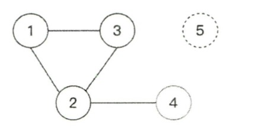

## Q: 什么叫复制日志的一致性算法，复制日志是什么意思
复制日志的一致性算法是一类用于管理在多个服务器之间复制和保持日志一致性的算法。在分布式系统中，确保各个节点之间的数据一致性是核心挑战之一。复制日志的一致性算法通过在多个节点之间复制相同的日志条目，并确保所有日志以相同的顺序被应用，来解决这一挑战。

### 复制日志（Replicated Log）的含义

复制日志是指在分布式系统的多个节点上存储相同的日志记录。这些日志记录通常包含了一系列的命令或操作，这些命令或操作需要在各个节点上按相同的顺序执行，以保证系统的状态一致性。复制日志通常用于实现如状态机复制（State Machine Replication, SMR）的模型，这是一种常见的分布式系统一致性模型。

### 如何实现

在一个复制日志系统中，通常有一个领导者（leader）节点负责接收客户端的请求，这些请求包含了需要执行的命令。领导者节点将这些命令作为新的日志条目添加到其日志中，然后将这些日志条目复制到其他的跟随者（follower）节点。跟随者节点将收到的日志条目添加到它们各自的日志中。

一旦日志条目被复制到了多数节点（达到了所谓的"多数派"），该条目就被认为是"提交的"（committed），之后领导者会通知所有节点应用这条日志条目，从而执行对应的命令。这确保了所有节点都以相同的顺序执行相同的命令，从而在整个系统中实现一致的状态。

### 典型例子：Raft算法

Raft算法是一个著名的复制日志的一致性算法，用于管理日志复制过程。它通过选举协议来确保在任何给定时刻只有一个领导者，这个领导者负责管理日志条目的复制和确定哪些日志条目可以被提交。Raft算法以其易于理解和实现而受到广泛的欢迎，是许多现代分布式系统和服务的基础。

### 应用场景

复制日志的一致性算法广泛应用于需要高可用性和数据一致性的系统，如数据库、分布式文件系统和云服务等。通过使用这种算法，这些系统可以在部分节点故障的情况下继续运行，同时保持数据的一致性和完整性。

总的来说，复制日志的一致性算法是分布式系统设计中的关键组件，它们通过同步分布式系统中的操作来确保系统状态的一致性和可靠性。

## Q: 什么是拜占庭将军问题
拜占庭问题，也被称为拜占庭将军问题（Byzantine Generals Problem），是一个著名的计算机科学问题，关注的是如何在分布式系统中达成一致性，即使在其中一些节点可能存在故障或恶意行为的情况下。这个问题最早由Leslie Lamport、Robert Shostak和Marshall Pease在1982年提出，并以拜占庭帝国的将军们（由于内部通信可能受到背叛者的干扰）作为一个类比。

### 问题背景

在拜占庭将军问题中，一群将军必须通过仅依赖信使传递的消息来协调一个共同的攻击计划。然而，一些将军可能是叛徒，会故意发送错误的信息，目的是让忠诚的将军无法达成一致。问题的核心是如何设计一个协议，使得忠诚的将军能够在一定数量的将军可能是叛徒的情况下，依然能够达成一致的决定。

### 拜占庭容错

拜占庭容错（Byzantine Fault Tolerance, BFT）是解决拜占庭问题的技术，指的是一个系统能够抵抗一定比例的拜占庭故障（即节点可能会发生任意类型的故障，包括恶意行为或数据损坏）并继续正常运行。拜占庭容错系统需要能够处理不仅是简单的故障（比如崩溃或响应超时），还包括更复杂的错误行为，如数据篡改或伪造消息等。

### 实现拜占庭容错

实现拜占庭容错的关键是确保系统中的节点即使在面对故障和攻击时也能保持一致性。这通常需要复杂的算法和多重验证机制。一个经典的解决方案是通过增加冗余，即多个节点必须对每一个重要的决策达成一致，从而抵抗少数节点的恶意行为。拜占庭容错协议通常要求超过三分之二的节点是诚实的，这样即使有少数节点行为异常或作恶，系统的主体部分仍然能保持正常运作。

### 应用

拜占庭容错机制在许多现代分布式系统和网络中非常重要，特别是在需要高度安全性的环境中，如金融服务、航空航天和军事系统等。最近，拜占庭容错也在区块链技术中扮演着核心角色，尤其是在公共区块链和加密货币的共识算法中，例如在比特币的工作量证明（PoW）以外，许多加密货币项目采用了各种形式的拜占庭容错协议来保障网络的安全和一致性。

拜占庭问题的提出和其解决方案的发展体现了分布式系统设计中对可靠性和安全性的深入考虑，它强调了在不可信环境中保持系统一致性的重要性和挑战。

## Q：一致性算法有什么特性
一致性共识算法是分布式系统中的关键组成部分，其主要目的是确保系统中的多个节点能够在存在故障和不确定性的环境中达成一致的状态。这类算法具有几个重要的特性，这些特性帮助系统保持稳定、可靠，并确保数据的一致性和完整性。以下是一致性共识算法的一些主要特性：

### 1. **一致性 (Consistency)**
   - 一致性保证所有的节点在给定时刻都同意系统的当前状态。这意味着任何已经在系统中达成共识的操作或决策，无论是数据值还是系统命令，都被所有非故障节点所接受并保持一致。

### 2. **容错性 (Fault Tolerance)**
   - 一致性共识算法需要能够容忍一定数量的节点故障。这包括节点完全失效（崩溃容错）以及节点可能的恶意行为（拜占庭容错）。算法应当保证，即便在面对这些故障时，系统依然能够达成并维持一致的共识。

### 3. **可用性 (Availability)**
   - 在非拜占庭情况下，即使部分系统组件失效，系统仍然能对客户端请求做出响应。这意味着系统应能继续操作，而不是完全停机。

### 4. **分区容忍性 (Partition Tolerance)**
   - 分区容忍性指系统能够在网络分区（网络故障导致节点间通信断开）的情况下继续正常运行。根据CAP定理（一致性、可用性、分区容忍性），在任何给定时刻，分布式系统只能同时满足其中两个属性，而分区容忍性通常是不可避免的需求，因此系统设计需要在一致性和可用性之间做出权衡。

### 5. **收敛性 (Convergence)**
   - 共识算法需要保证最终所有正确运行的节点都能达到一个共同的状态，即使在面对故障和网络分区的情况下。这意味着系统必须能够从任何合法的状态收敛到一致的状态。

### 6. **终止性 (Termination)**
   - 共识算法必须确保决策过程最终完成，而不是无限期地等待某个条件的满足。这意味着算法应当设计为能够在有限的时间内达成决策。

### 7. **活性 (Liveness)**
   - 系统需要响应用户的操作请求，即使这些操作由于系统内的故障或其他原因被延迟处理。活性保证了系统不会陷入停滞状态。

这些特性共同构成了一致性共识算法的基础，使它们能够在分布式计算环境中提供高效、可靠和安全的数据管理和操作执行。不同的共识算法可能会侧重这些特性中的某些，根据实际应用的需求和特定场景进行优化。

## Q：拜占庭将军问题的解决方案是什么？
对于拜占庭问题来说，假如节点总数为 N，故障节点数为 F，则当 N >= 3F + 1 时，问题才能有解，由 BFT 算法进行保证。

拜占庭将军容错问题可以参考链接(https://yeasy.gitbook.io/blockchain_guide/04_distributed_system/bft)

后续的算法基本上是基于“实用拜占庭容错算法”（Practical Byzantine Fault Tolerance，PBFT） 算法进行的优化和演进, 其中Raft和paxos算法就是典型的非拜占庭容错算法

## Q: 分布式系统解决了什么问题？

## Q: 当今分布式系统面临的挑战是什么？
分布式系统的八大谬论如下：

## Q：什么是分布式共识算法？
### 分布式共识简介
首先，分布式共识是为了由解决多个不可靠的实体对某个命令的达成共识并做出一致决定所提出的问题。最早的算法是SIFT(software implemented fault tolerance, 软件实现容错)系统，它提出来拜占庭将军问题和其解决方案

### 什么是分布式共识算法
分布式共识就是在一个可能出现任意故障的分布式系统汇总的多个节点(进程)对某个值达成共识。

- [深入理解分布式系统-第四章分布式共识]()

## Q：共识和一致性的区别
在分布式系统中，共识（Consensus）和一致性（Consistency）是两个密切相关但概念上有所不同的术语。理解这两者的差异对于设计和实现分布式系统是至关重要的。

#### 共识（Consensus）

共识是分布式系统中多个节点就某个值或状态达成一致意见的过程。这通常涉及到决策过程，例如决定哪个节点应该成为下一个领导者（领导选举），或者在多个节点间决定数据的最终值（如在事务中决定是否提交）。共识是一个动态过程，它涉及到系统中各个部分之间的沟通和协调，目的是确保即使在面对故障和不确定性的情况下也能作出一致的决策。

共识算法的目标是确保所有非故障节点最终可以就某个特定的操作或值达成一致。著名的共识算法包括Paxos、Raft和共识机制在区块链技术中的应用，如Proof of Work或Proof of Stake。

### 一致性（Consistency）

一致性是指在分布式系统中数据在多个节点间保持一致的特性。这涉及到系统状态的同步问题，确保所有用户看到的数据版本是一致的。一致性是一个属性或状态，描述的是系统达到的某种程度的数据整合。

一致性可以有多种不同的级别，从弱一致性到强一致性不等。例如，最终一致性保证说，如果没有新的更新，系统最终将达到一致的状态。在更强的一致性模型中，如线性一致性或序列一致性，系统保证所有操作都是有序的，且每个操作的结果立即对所有节点可见。

### 共识与一致性的关系

共识和一致性虽然在目标上有所不同，但它们在实际应用中是紧密相关的：
- **共识算法**是达成一致性所使用的一种机制。通过共识，系统中的各个节点可以就某个特定的值或操作达成一致意见，从而维护系统的一致性状态。
- **一致性**是一个广义的目标，即保持数据在多个节点间的同步和一致。共识是实现一致性的手段之一。

在设计分布式系统时，开发者必须根据系统的需求和性能考虑选择合适的共识机制和一致性模型。这两者的选择将直接影响系统的可靠性、可用性和性能。

## Q：除了分布式共识算法，要达成分布式一致性还有什么手段
除了分布式共识算以外的一些常用的实现分布式一致性的手段：
### 1. **副本控制协议（Replication Protocols）**
- **主从复制（Master-Slave Replication）**：一个节点（主节点）控制数据的写入，其他节点（从节点）复制主节点的数据。这种方式简单易实现，但主节点成为单点故障。
- **对等复制（Multi-Master or Peer-to-Peer Replication）**：每个节点都可以接受写入操作，并与其他节点同步更新。这增加了复杂性，但提高了系统的可用性和弹性。

### 2. **事务控制协议**
- **两阶段提交（2PC, Two-Phase Commit）**：这是一种保证在分布式数据库系统中事务一致性的协议，它将事务提交过程分为两个阶段来确保所有参与节点都同意提交事务。
- **三阶段提交（3PC, Three-Phase Commit）**：是两阶段提交的改进版，增加了一个预提交阶段，以减少阻塞和避免一些故障情况。

### 3. **日志复制**
- **写前日志（Write-Ahead Logging）**：在数据被更新或修改前，先将操作记录到日志中。这种方法确保了即使系统发生故障，也能从日志恢复数据状态。
- **日志结构合并树（LSM Trees）**：主要用在数据库索引技术中，通过将写入操作先记录在内存中的结构里，然后周期性地与磁盘上的数据结构合并，从而优化写入性能并保持数据一致性。

### 4. **向量时钟和版本向量**
- 这些是跟踪数据版本和处理冲突的方法，尤其适用于无中心和最终一致性模型，例如在分布式文档存储和对象存储中广泛使用。

### 5. **CRDTs（冲突自由复制数据类型）**
- CRDTs 允许数据在无需同步的情况下在多个节点间独立更新，并通过设计来保证数据状态的最终一致性。CRDTs 是处理分布式网络中延迟和分区容忍性问题的有效手段。

### 6. **时间戳和序列号**
- 使用时间戳或序列号为数据版本提供唯一标识，帮助解决并发控制和数据一致性问题。

### 7. **领域分区（Sharding）**
- 将数据分布到不同的服务器或节点上，每个节点负责数据的一部分。通过控制数据分片的一致性来管理和维护整体数据一致性。

## Q：FLR不可能定理是什么？

## Q：分布式算法中的安全性(safety)和活性(liveness)是什么?

## Q: Raft算法如何解决follower日志不一致问题？

## Q：Raft算法如何解决网络分区导致的双主问题？如何解决客户端访问错误leader导致的一致性问题？

## Q：Raft算法如何解决Leader提交状态机后crash导致客户端重试的问题？
Leader提交状态机后crash导致客户端重试会导致客户端重新提交一次请求，那么同一个命令会被执行两次(从客户端角度来看只有一次，但是服务端却将同一个命令提交了两次，这违反了线性一致性)。

## Q：Raft算法如何解决配置变化下新老集群配置不一致导致多主的问题？
如图所示：

## Q：Raft算法Pre-vote的作用是什么？解决了什么场景？
**Pre-vote的条件：**
- 参数中的任期更大，或者任期相同但日志索引更大
- 至少一次选举超时时间内没有收到Leader的心跳

## Q：Raft算法Pre-vote机制导致下图场景下的活性问题，如何解决？

## Q: Raft算法的Learner是什么？作用是什么？

## Q: Raft算法日志压缩的关键点是什么？

## Q：分布式共识和分布式事务的区别？
参考：
1. Chatgpt：分布式共识和分布式事务的区别？
2. 分布式事务(2PC) vs 共识协议(Paxos/raft) [https://blog.csdn.net/flynetcn/article/details/124179754]
3. DDIA：共识协议和分布式事务有什么关系？[https://cloud.tencent.com/developer/article/2367461]
4. 知乎：分布式共识和分布式事务的区别？[https://www.zhihu.com/question/388155097]
